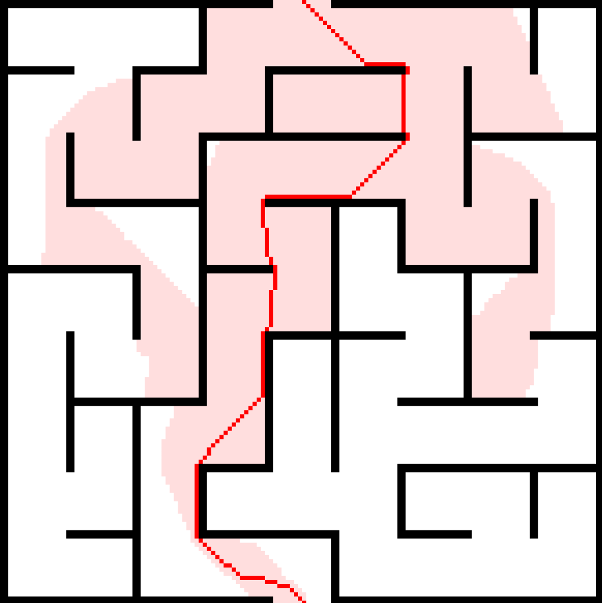

## PathFinder Grid 2D (A*)

Path finder on 2D grids with A* algorithm with 400 lines of code in a single header file. Includes a stable and a fast path finders for different needs. The fast path finder has runtime performance close to [this project](https://github.com/Eurecat/astar-gridmap-2d) (analyzed on 1 October 2022).

Note: Tested on Ubuntu 20.04.

## Features

- Includes a theoretically correct stable A* path finder (`PathFinderGrid2D`) with Fibonacci Heap
- Includes a aggressively optimized (but 4x faster) A* path finder (`FastPathFinderGrid2D`) with Priority Queue.
- Besides raw arrays, also supports  `boost::dynamic_bitset`. See `demo.cpp`.
- Heuristic functions can be disabled, so the algorithm becomes Dijkstra. (Only use it with `PathFinderGrid2D`).
- 4 or 8 neighbor checking. 8 neighbor is the default. The algorithm may run faster with 4 neighbor.
- Includes a demo code. See `demo.cpp`.

## Compile and Run the Demo

```bash
$ sudo apt install libboost1.71-dev
$ git clone https://github.com/salihmarangoz/astar_pathfinder_grid_2d.git
$ cd astar_pathfinder_grid_2d
$ mkdir build
$ cd build
$ cmake ..
$ make -j8
$ ./demo
```


## How to include this in my project

1. You need the boost library. You can install it on Ubuntu with `sudo apt install libboost1.71-dev`

2. Copy `pathfinder_grid_2d.h` into your project and include it. No need to compile!

## How to use path finding

```c++
// Prepare your 2d matrice. Make sure the data array is contiguous!
cv::Mat img = cv::imread("maze.png", cv::IMREAD_GRAYSCALE);

// Select a path finder. Fast algorithm works 4x faster but applies many approximations.
pathfinder_grid_2d::PathFinderGrid2D<uchar> planner(img.data, img.rows, img.cols); // Stable Path Finder
//pathfinder_grid_2d::FastPathFinderGrid2D<uchar> planner(img.data, img.rows, img.cols); // Fast Path Finder

int s_i = 0, s_j = 0; // start pos
int e_i = 199, e_j = 199; // end pos
pathfinder_grid_2d::Path out; // output array

bool success = planner.plan(s_i, s_j, e_i, e_j, out, 127, false); // obstacles has lower values since black pixels are zero. We set the threshold to 127 since white pixels are 255.
```

## Screenshots of the Demo Code



## FAQ

- Why did you use Fibonacci Heap for stable path finder, and Priority Queue for fast path finder?
  - Priority Queue is very fast with push and pop operations. But if we want to implement A* correctly we need to update values in the heap. In this case, Fibonacci Heap comes to the rescue! For more: https://www.boost.org/doc/libs/1_80_0/doc/html/heap/data_structures.html
- Are A* heuristics that important?
  - Short answer: Yes. Selected heuristic affects the performance and the runtime of the algorithm significantly. For more: https://theory.stanford.edu/~amitp/GameProgramming/Heuristics.html

More questions? Please open an issue.
